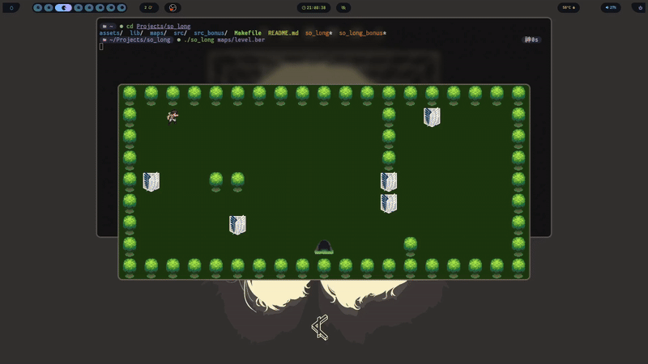
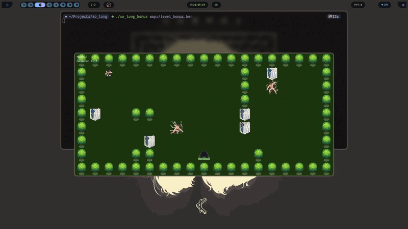

<p align="center">
  
</p>

# 🎮 so_long – A 2D MiniLibX Game

**so_long** is a small 2D game developed using the **MiniLibX** graphical library. The objective is simple: collect all items and reach the exit – but the game’s design, map parsing, and memory management require precision, logic, and a strong grasp of C.

---

## 📚 Project Overview

**Objective:**  
Create a playable 2D game with sprite rendering, event handling, and map validation using MiniLibX.  

**Theme:**  
Fully customisable – the original theme is a dolphin collecting fish to escape Earth, but alternative worlds, sprites and mechanics are welcome.

**Language:** C  
**Graphics Library:** MiniLibX  
**Map Format:** Custom `.ber` file

---

## 🧩 Features – Mandatory Part

### 🎯 Game Mechanics

- Player uses **WASD** (or arrows) to move in four directions.
- Goal: Collect all collectibles (`C`) and reach the exit (`E`).
- Movement is blocked by walls (`1`).
- Moves counter is printed in the terminal on each movement.
- The game is **not real-time**, and uses a **2D perspective** (top-down or profile).

### 🗺️ Map Requirements

- Must be **rectangular** and fully enclosed by walls.
- Allowed characters:
  - `1` – wall
  - `0` – floor
  - `C` – collectible
  - `E` – exit
  - `P` – player starting position
- Must include:
  - **1** player start (`P`)
  - **1** exit (`E`)
  - At least **1** collectible (`C`)
- Program validates map and exits with clear error messages if any rules are violated.
- Must verify existence of a **valid path** from start to all collectibles and to the exit.

### 🖼️ Graphic Management

- Each tile is rendered using **textures** from MiniLibX.
- Supports window resize, minimize, and ESC/cross-button exit.
- All rendering and input handled via MiniLibX.

---

## 🖥️ Preview – Standard Game





---

## ✨ Bonus Features

The bonus features extend the game logic and interface:

| Feature                            | Implemented |
|------------------------------------|-------------|
| Enemy patrol that causes defeat    | ✅           |
| Sprite animation                   | ✅           |
| On-screen move counter             | ✅           |

### Additional Bonus Details

- Enemies move with a predictable or random patrol pattern. Touching one ends the game.
- Sprites (e.g., player, enemies, collectibles) are animated using frame cycling.
- Movement count is updated and rendered directly in the game window using MiniLibX’s font/text functions.

---

## 🎮 Preview – Bonus Version




---

## 🛠️ Compilation & Usage

Compile

```c
make          # for mandatory version
make bonus    # for bonus version
```
Run
```c
./so_long maps/mapname.ber
./so_long_bonus maps/mapname.ber
```

## 🎯 What I Learned

Through so_long, I strengthened skills in:
  - Manual memory management in C
  - Event-driven programming and keyboard input
  - Parsing and validating structured files (maps)
  - Game state management
  - Sprite-based animation and image rendering
  - Clean exit handling and error reporting
